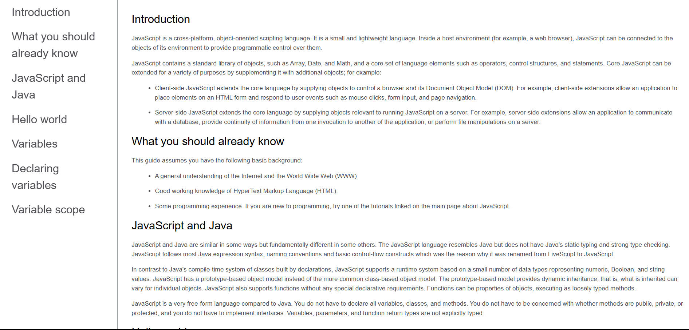

# 📚 Documentation

Welcome to the **Documentation** repository! This project consists of a simple and responsive technical page, developed with **HTML5** and **CSS3**. The goal is to practice the creation of informative and visually pleasing pages, essential for the presentation of technical documentation on websites and web applications.​

## Layout

    

## 📋 Features

- **Technical Page:** Presents structured information on a given subject, using sections and subsections to organize the content in a clear and objective way.

- **Responsive Layout:** Adapts to different screen sizes, ensuring a good experience on mobile devices and desktops.

- **Clean and Intuitive Design:** Uses a soft color palette and legible typography to facilitate reading and navigation.​

## 🛠️ Technologies Used

- **HTML5:** Semantic structuring of the page content.

- **CSS3:** Responsive page styling and layout.​